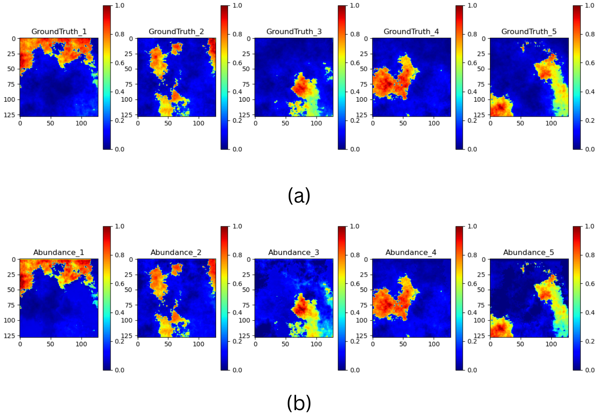
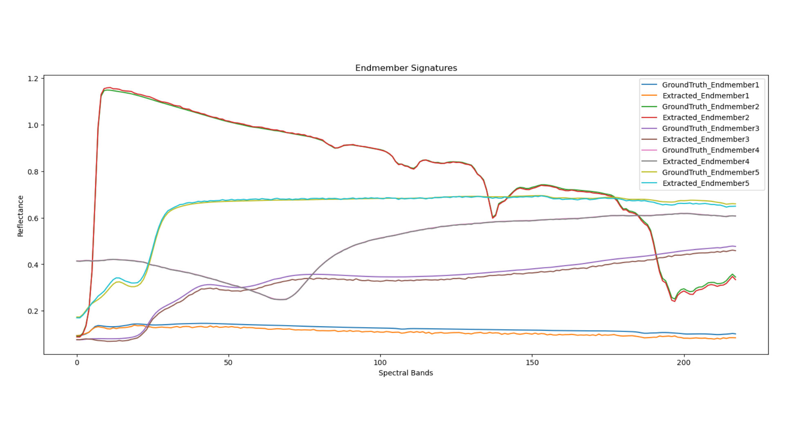
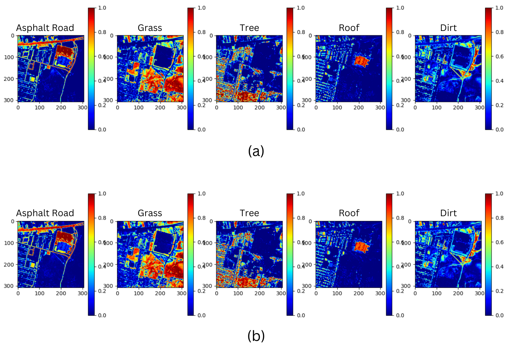
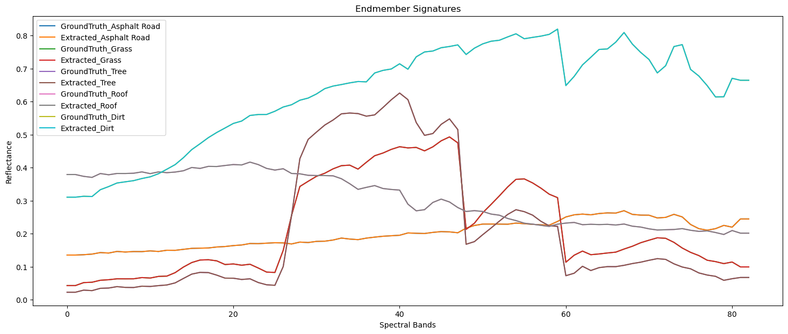

# HYPERSPECTRAL BIORNET - A COMPLETE WAVELET FRAMEWORK FOR UNMIXING

This repository contains the code implementation of our research paper, **"Hyperspectral BiorNet: A Complete Wavelet Framework For Unmixing,"** submitted to IGARSS 2025. The project presents a novel framework leveraging wavelet transformations and neural networks to enhance hyperspectral unmixing accuracy.

## Table of Contents
1. [Introduction](#introduction)
2. [Features](#features)
3. [Requirements](#requirements)
4. [Installation](#installation)
5. [Usage](#usage)
6. [Evaluation](#evaluation)
7. [Results](#results)
8. [Citation](#citation)
9. [License and Copyright](#license-and-copyright)

---

## Introduction
Hyperspectral unmixing (HSU) is a critical task in remote sensing, involving the decomposition of mixed spectral signatures into pure spectral components (endmembers) and their respective abundances. The **Hyperspectral BiorNet** leverages:

- **Biorthogonal 3.3 Wavelet Transformations** for feature extraction.
- **Wavelet-Inspired Activation Function** to enhance spectral-spatial representation.
- **Deep Learning** techniques for robust and efficient unmixing.

The framework is designed to address challenges like noise, spectral variability, and overlapping signatures, enabling precise extraction of material components from hyperspectral images.

---

## Features
- **Wavelet Transformation Framework**: Biorthogonal 3.3 wavelet decomposition to preserve spatial-spectral features.
- **Wavelet-Inspired Activation Function**: Combines oscillatory and smoothing effects for enhanced feature extraction.
- **Hybrid Neural Network**: Combines CNN and LSTM layers for endmember extraction and abundance estimation.
- **Evaluation Metrics**: Includes RMSE, Spectral Angle Distance (SAD), and Spectral Information Divergence (SID).

---

## Requirements
- Python 3.8+
- PyTorch 2.1.1+cu118
- NumPy
- SciPy
- Matplotlib
- scikit-learn

---

## Installation

Clone the repository:
```bash
https://github.com/GaganaMD/Hyperspectral-Wavenet.git
cd hyperspectral-biornet
```

Install the required dependencies:
```bash
pip install -r requirements.txt
```

---

## Usage
1. **Prepare Data**: Ensure your hyperspectral image data is in the correct format. 
2. **Run the Code**:
   - Train the model: `python train.py`
   - Evaluate the model: `python evaluate.py`
3. **Visualization**: Use the included scripts to visualize predicted abundance maps and extracted endmembers.

---

## Evaluation
The model is evaluated using the following metrics:
1. **Root Mean Squared Error (RMSE)**: Measures prediction error.
2. **Spectral Angle Distance (SAD)**: Quantifies spectral similarity.
3. **Spectral Information Divergence (SID)**: Assesses divergence between predicted and ground truth spectra.

---

## Results
### Synthetic Data
- **Abundance Maps**:
  
- **Extracted Endmembers**:
  

### Real Data (HYDICE Urban Dataset)
- **Abundance Maps**:
  
- **Extracted Endmembers**:
  

---

## Citation
If you use this code or find it helpful, please cite:
```
@article{Gagana2025HyperspectralBiorNet,
  title={Hyperspectral BiorNet: A Complete Wavelet Framework for Unmixing},
  author={Gagana M D and Ajay Kumar K and Vijayashekhar S S and Jignesh S. Bhatt},
  journal={Proceedings of the Hyperspectral Imaging Workshop},
  year={2025},
  publisher={Acharya Institute of Technology}
}
```

---


## License and Copyright
This repository contains the official implementation of the research work submitted to IGARSS 2025. The content of the paper and this code are protected under copyright. Citation details will be updated upon acceptance.

For inquiries regarding the code or paper, please contact: **gaganad.21.beai@acharya.ac.in**.

